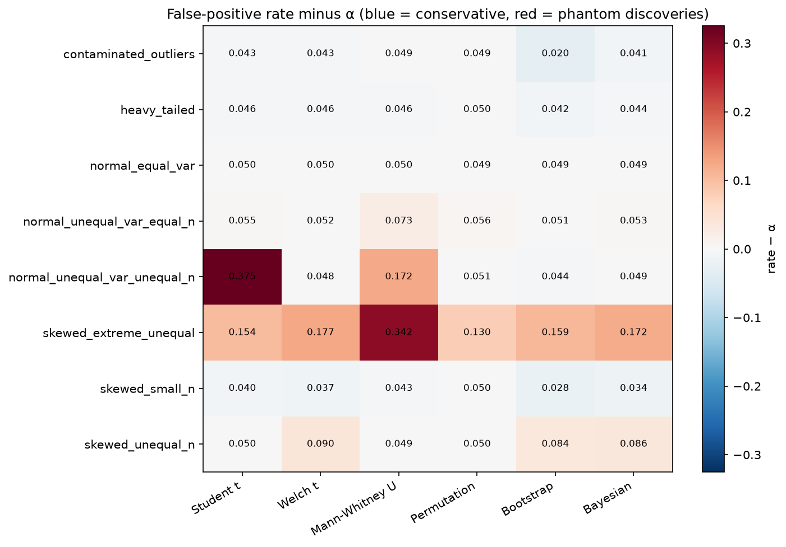
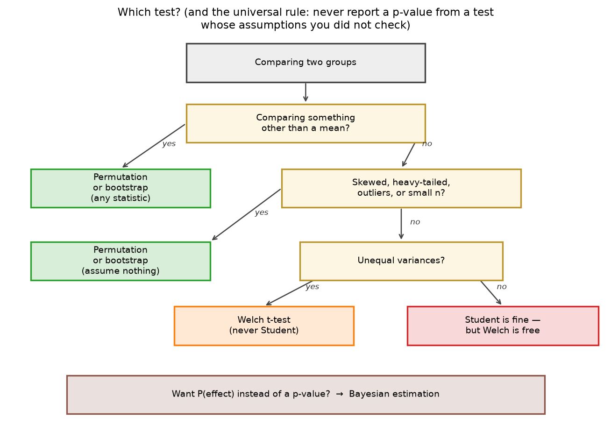

# hypothesis_testing_arena

**The t-test you were taught assumes a bell curve your data does not have.**

A head-to-head comparison of six ways to answer the one question every experiment asks — *are
these two groups actually different?* — judged by simulation against a known truth.

Six tests (Student t, Welch t, Mann-Whitney U, permutation, bootstrap, Bayesian estimation),
each written from scratch and validated against scipy, run 10,000 times across eight conditions:
normal, skewed, heavy-tailed, contaminated with outliers, unequal variances, unbalanced groups.

---

## The headline

Two groups drawn from populations with **exactly the same mean**. 100 observations in one, 15 in
the other, and the smaller group has four times the spread — the shape of a real experiment where
the treatment arm is smaller and noisier. There is nothing to find.

| Test | False-positive rate | Promised |
|---|---|---|
| **Student t** | **0.375** | 0.05 |
| Welch t | 0.048 | 0.05 |
| Permutation | 0.051 | 0.05 |

The Student t-test called a significant difference **37.5% of the time when there was none** —
7.5× the rate it promises. No error, no warning, no diagnostic. Just a confident number, and
every one of those results is a discovery that does not exist.

Welch, which differs only in not assuming equal variances, sits on α. So does the permutation
test, which assumes nothing at all.



---

## The full scoreboard

False-positive rate under the null; every cell should read 0.05. 10,000 replications, Monte Carlo
standard error ≈ 0.0022.

| Condition | Student | Welch | Mann-Whitney | Permutation | Bootstrap | Bayesian |
|---|---|---|---|---|---|---|
| normal, equal variance | 0.050 | 0.050 | 0.050 | 0.049 | 0.049 | 0.049 |
| heavy-tailed | 0.046 | 0.046 | 0.046 | 0.050 | 0.042 | 0.044 |
| contaminated (outliers) | 0.043 | 0.043 | 0.049 | 0.049 | **0.020** | 0.041 |
| skewed, small n | 0.040 | 0.037 | 0.043 | 0.050 | **0.028** | 0.034 |
| unequal variance, equal n | 0.055 | 0.052 | **0.073** | 0.056 | 0.051 | 0.053 |
| **unequal variance, unequal n** | **0.375** | 0.048 | **0.172** | 0.051 | 0.044 | 0.049 |
| skewed, unequal n | 0.050 | **0.090** | 0.049 | 0.050 | **0.084** | **0.086** |
| skewed + unequal spread + small group | **0.154** | **0.177** | **0.342** | **0.130** | **0.159** | **0.172** |

| Test | Worst FPR | Inflated cells | Conservative cells | Mean power |
|---|---|---|---|---|
| Student t | 0.375 | 2 | 2 | 0.732 |
| Welch t | 0.177 | 2 | 2 | 0.676 |
| Mann-Whitney U | 0.342 | 3 | 1 | 0.799 |
| **Permutation** | **0.130** | **1** | **0** | 0.644 |
| Bootstrap | 0.159 | 2 | 3 | 0.616 |
| Bayesian | 0.172 | 2 | 2 | 0.671 |

**The permutation test is the only contender with a single inflated cell**, and that cell is the
extreme-skew condition where nothing works.

---

## What the simulation actually found

Some of this contradicts what the project set out to show. The measurements won.

**Student's failure needs unequal *sample sizes*, not just unequal variances.** At equal n with
the same 4× variance ratio, Student runs at 0.055 — essentially fine. That is precisely why the
failure is invisible in textbook examples, and why it took an unbalanced design to expose it.

**Welch is not universally safe.** On skewed unbalanced data Welch is the one running hot (0.090)
while Student happens to be nearer nominal (0.050). Neither t-test is reliable everywhere; they
are unreliable in different places.

**"Permutation test" is not automatically safe either.** Permuting raw mean differences on the
showpiece data gives a false-positive rate of **0.367** — it fails almost exactly like Student,
because permutation is only exact under full exchangeability, which unequal variances break.
Permuting **Welch t statistics** gives **0.051**. Studentizing is what makes the claim true, and
it is the default in this implementation.

**Skew does not cost power at a fixed Cohen's d — it costs validity.** Power on lognormal data
comes out *higher* than on normal data at the same d, because d divides by a standard deviation
the long tail has inflated. Effect sizes in standard deviations are not portable across
distribution shapes; compare tests within a condition, never across conditions.

**Under skew, the t-test does not lose power to a permutation test on the same statistic.**
Student, Welch and permutation-on-the-mean land within a point of each other at n = 15. The
permutation test's real advantage is that it is free to test a *different statistic* — swapping
the mean for a trimmed mean recovers a large chunk of power at the same α.

**Mann-Whitney's red cells are not miscalibration.** Where variances differ, the two
distributions genuinely differ, so a test of stochastic dominance is *correct* to reject. It is
answering its own question well; the error would be reading that answer as a statement about
means.

**There is a condition where nothing works.** Skewness 14 concentrated in the smaller group
defeats every mean-based test in the arena (0.130–0.342). It is kept in the grid on purpose. A
project about overclaimed tests should not overclaim.

**Twenty metrics, none of them changed, all tests perfectly calibrated:** at least one comes back
"significant" **64.3%** of the time (theory says 64.15%). No test fixes that.

---

## Quick start

```bash
make setup       # install uv, sync deps, register the Jupyter kernel
make test        # 68 tests, ~20s
make notebooks   # execute all six notebooks -> outputs/figures/*.png, outputs/results/*.json
make run         # Streamlit app on :8501
make ci          # sync + lint + test, at the reduced-rep profile
```

Everything runs on a **2-CPU / 8 GB GitHub Codespace**. No GPU, no dataset to download — every
number in the project comes from seeded simulation.

---

## The six contenders

| Test | Idea | Assumes |
|---|---|---|
| **Student t** | pooled variance, `df = n_a + n_b − 2` | normality **and equal variances** |
| **Welch t** | separate variances, Welch–Satterthwaite df | normality only |
| **Mann-Whitney U** | compare ranks, not values | nothing about shape — but tests *stochastic dominance*, not a difference in means |
| **Permutation** | shuffle the labels, build the null from the data | nothing (studentized by default) |
| **Bootstrap** | resample each group, read the interval of the difference | nothing |
| **Bayesian** | Jeffreys priors → `μ \| data ~ t(x̄, s/√n)`, report P(b > a) | normality; no p-value, by design |

All six are written from scratch in [src/tests/](src/tests/) and match scipy **exactly** on clean
data (difference 0.0 across all three alternatives, with and without ties).

---

## Notebooks

| | Notebook | What it does |
|---|---|---|
| 01 | [The Question and the Reflex](notebooks/01_the_question_and_the_reflex.ipynb) | Shows the t-test *working*, and sets the scoring rubric |
| 02 | [When the t-Test Breaks](notebooks/02_when_the_t_test_breaks.ipynb) | The showpiece: 37.5% false positives, and the p-value uniformity proof |
| 03 | [The Assumption-Free Tests](notebooks/03_the_assumption_free_tests.ipynb) | Permutation, bootstrap and Mann-Whitney built on the data that broke Student |
| 04 | [The Arena](notebooks/04_arena.ipynb) | Six tests × sixteen scenarios × 10,000 replications |
| 05 | [Power and Sample Size](notebooks/05_power_and_sample_size.ipynb) | How much data you need, and the twenty-metric trap |
| 06 | [Decision Framework](notebooks/06_decision_framework.ipynb) | The flowchart, and the `compare_groups` tool |

Each notebook writes its figures to `outputs/figures/` as PNG and **every number and claim it
makes** to `outputs/results/*.json`, so nothing quoted in prose exists only inside a notebook
output cell.

---

## The answer, in one picture



And the four rules:

1. **Welch is the default.** There is no situation where Student is right and Welch is wrong.
2. **Check assumptions before trusting a parametric p-value.** Not after, and not never.
3. **When in doubt, use the assumption-free test.** Its only cost is compute.
4. **Never report a p-value from a test whose assumptions you did not verify.**

Rule 2 is the one that gets skipped, so it ships as code:

```python
from src.evaluation.comparison import compare_groups

result = compare_groups(a, b, test="student")
# UserWarning: student t-test: unequal spread (sd ratio 3.41): never use the Student
#   t-test here; Welch, permutation or bootstrap
# UserWarning: student t-test: small sample (n = 80, 12): ...
```

`compare_groups` defaults to the **permutation test**, not a t-test.

---

## Layout

```
config/settings.yaml    every seed, rate and sample size; nothing is hard-coded in src/
src/tests/              the six tests, from scratch
src/simulation/         populations and scenarios with known ground truth
src/evaluation/         false-positive rate, power, p-value calibration, the arena
src/visualisation.py    every figure in the project
notebooks/              narrative only — no logic
app/streamlit_app.py    break the assumptions yourself and watch α move
outputs/figures/        committed PNGs
outputs/results/        committed JSON: the numbers behind every claim
```

### Reproducibility

Seeded end to end. Data and test randomness use **separate** generator streams, so every test in
the arena sees byte-identical samples within a scenario — a head-to-head difference is a
difference between the tests, not between the draws. The full arena is cached against a hash of
its own content; change a scenario, a seed, α or a replication count and it recomputes.

The full arena takes about **9.5 minutes** cold on a 2-CPU Codespace and loads in milliseconds
warm. `make ci` runs a reduced-rep profile (`HTA_PROFILE=ci`).

---

## References

- Student (Gosset, W.S.) (1908). "The Probable Error of a Mean." *Biometrika.*
- Welch, B.L. (1947). "The Generalization of Student's Problem when Several Different Population Variances are Involved." *Biometrika.*
- Mann, H.B. and Whitney, D.R. (1947). "On a Test of Whether One of Two Random Variables is Stochastically Larger than the Other." *Annals of Mathematical Statistics.*
- Janssen, A. (1997). "Studentized permutation tests for non-i.i.d. hypotheses and the generalized Behrens-Fisher problem." *Statistics & Probability Letters.*
- Good, P. (2005). *Permutation, Parametric, and Bootstrap Tests of Hypotheses* (3rd ed.). Springer.
- Chung, E. and Romano, J.P. (2013). "Exact and asymptotically robust permutation tests." *Annals of Statistics.*
- Kruschke, J. (2013). "Bayesian Estimation Supersedes the t Test." *Journal of Experimental Psychology: General.*
- Delacre, M., Lakens, D., and Leys, C. (2017). "Why Psychologists Should by Default Use Welch's t-test Instead of Student's t-test." *International Review of Social Psychology.*

## Related

[ab_testing_lab](https://github.com/Dima806) (experiment design and peeking) ·
[bootstrap_101](https://github.com/Dima806) (the resampling machinery) ·
[bayesian_101](https://github.com/Dima806) (Bayesian estimation) ·
[imputation_arena](https://github.com/Dima806) (the known-ground-truth methodology)

## License

Apache-2.0
