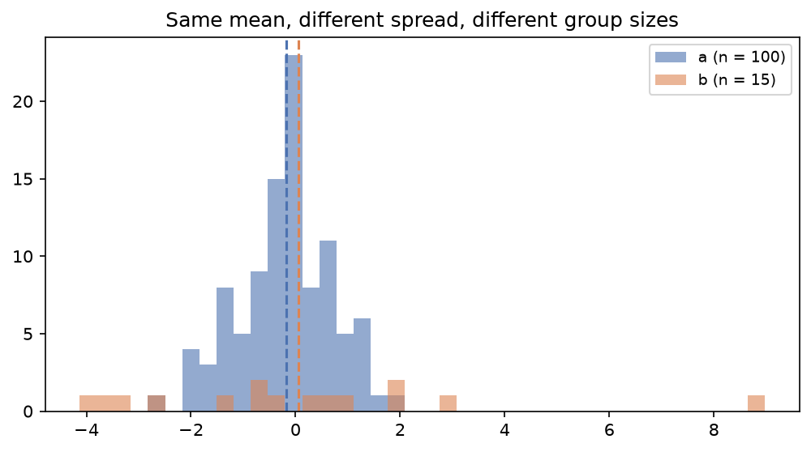
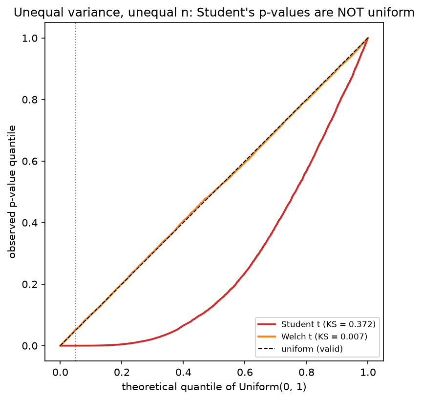
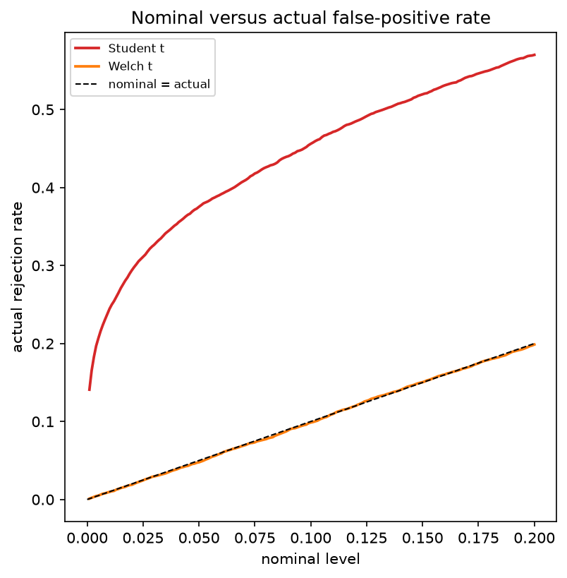
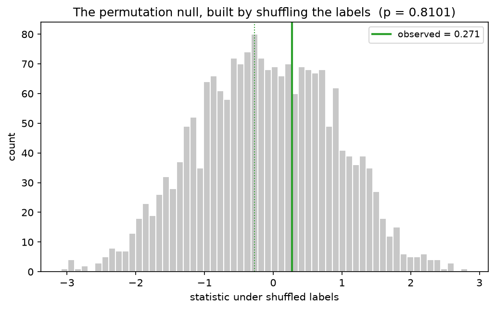
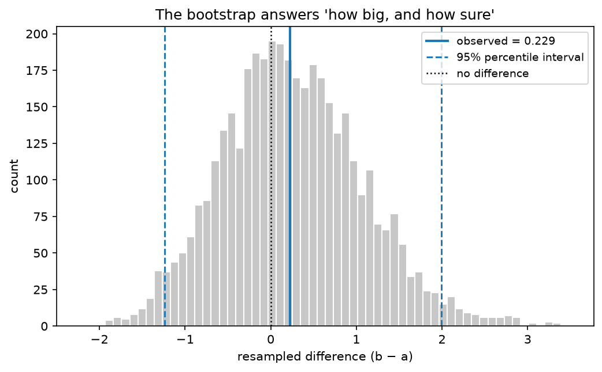
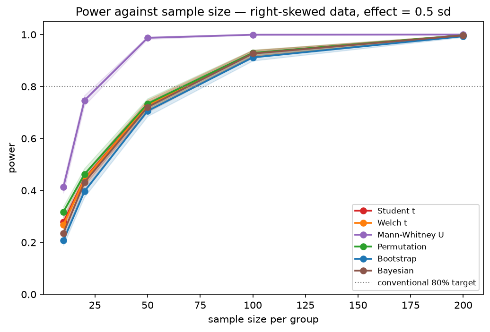

# Hypothesis Testing 101: Your t-Test Just Found 3,753 Effects That Do Not Exist

### Ten thousand simulations on two groups with identical means. The test everyone reaches for first called a difference 37.5 percent of the time, and the fix is one keyword argument.

A while back I ran an experiment with a small treatment arm. About a hundred users in control, fifteen in the variant, because that was who we could enrol before the deadline. The variant looked noisier, which made sense, since the change we shipped affected how much people spent and not just whether they spent. I ran a t-test, got p = 0.03, wrote it up, and moved on.

I have been thinking about that number ever since I built the simulation in this article. Two groups drawn from populations with exactly the same mean, sized 100 and 15, with the smaller group four times as spread out. No effect at all. I ran the standard equal-variance t-test on that setup ten thousand times.

It reported a significant difference 3,753 times.

Not five percent, which is what a test at alpha = 0.05 promises. Thirty-seven and a half percent. Seven and a half times the advertised rate, with no error, no warning, and no diagnostic. Just a confident little number in a cell, and a practitioner who believes it.

Here is the data it was looking at:



*Source: author*

Nothing about that picture screams "trap". It is what an unbalanced experiment on a metric with variance looks like.

## What a t-test actually promises

The t-test is not broken. It is a specific instrument with specific assumptions, and it keeps its promises when they hold. Two assumptions matter: both groups are roughly normally distributed, and **the two groups have equal variances**.

The second is the one nobody checks. It is also the one baked into the default, because in most people's heads "the t-test" means the pooled-variance Student version, which assumes it.

Student pools the two sample variances into a single estimate weighted by degrees of freedom. When one group is much bigger it dominates the pool, so in my setup the pooled variance ends up close to the large, tight control group's variance. That badly understates the real standard error of the difference, a too-small denominator makes the t statistic too big, and every borderline result gets pushed across the line.

Before going further, the control condition. On clean, normal, equal-variance data with 50 per group, the same code gives a false-positive rate of 0.0496 for Student and 0.0495 for Welch against a nominal 0.05, and catches a real 0.8 sd effect 97.8 percent of the time. The t-test works. This is not an article about a broken tool, it is about a tool used outside its range.

## How to grade a test

A test can fail in two directions. It can cry wolf when the groups are identical, which is a false positive, or shrug when they genuinely differ, which is a miss. The first is the expensive one, because false positives get published, shipped, and believed.

You cannot see either from a single p-value. You have to simulate from a population whose truth you control, run the test thousands of times, and count. That is why every number here comes from ten thousand replications rather than from one dataset.

One discipline goes with it: report the Monte Carlo error. At 10,000 replications the standard error of a rate near 0.05 is about 0.0022, so 0.054 against 0.050 is noise and 0.375 against 0.050 is not.

## Six contenders

I wrote six two-sample tests from scratch, checked each against scipy on clean data where they agree exactly, then ran all six across eight conditions. Student t pools the variances. Welch t does not. Mann-Whitney U compares ranks instead of values. The permutation test shuffles the group labels to build a null distribution out of the data itself. The bootstrap resamples each group and reads the interval of the difference straight off. Bayesian estimation reports the probability that b beats a instead of a p-value.

Every cell below is a false-positive rate under a true null, and every one should read 0.05.


*Source: author*

Red is a test inventing discoveries. Blue is a test being too cautious. White is correct.

Four things are visible at once, and only the first is the one I expected.

## 1. Student's disaster is real, and it needs unequal sample sizes

The dark cell is `normal_unequal_var_unequal_n`: 0.375 against 0.05. That is the setup from the top of this article.

Now look one row up, at `normal_unequal_var_equal_n`. Same populations, same four-to-one variance ratio, but 50 observations in each group instead of 100 and 15. Student's false-positive rate there is 0.055. Essentially fine.

This is why the failure is invisible. Unequal variance alone does not break the Student t-test. Unequal variance **plus unequal group sizes** breaks it, and the direction matters: it goes badly wrong when the group with the larger spread is the smaller group. Every textbook example is balanced. Every demonstration in an intro course is balanced. Real experiments, with an opt-in variant arm or a hard enrolment deadline, are not.

Welch on the same broken cell: 0.048. It fixes the problem completely, and it costs nothing.

## 2. The p-values are not just wrong at 0.05, they are wrong everywhere

"Rejects too often at alpha = 0.05" is a symptom. The disease is that the p-value does not mean what it says at any threshold.

A valid test rejects at exactly alpha for every alpha at once, which is the same statement as: under the null, the p-values are uniformly distributed between 0 and 1. Here is that check on the broken cell.



*Source: author*

Welch traces the diagonal. Student's Kolmogorov-Smirnov distance from uniform is 0.372, against 0.007 for Welch on the same data.

The practical version of the same plot is more useful. Pick the level you asked for on the x-axis and read the level you actually got.



*Source: author*

Ask Student for one percent on this data and it gives you roughly a third.

## 3. Welch is not universally safe either

This one surprised me, and it is the reason I am glad I built the grid instead of the single demo.

Look at `skewed_unequal_n`, which is right-skewed data (think revenue, or session length) with 100 in one group and 15 in the other. Welch runs at 0.090. Student runs at 0.050. On that row, the test I had just spent two notebooks recommending is the one misbehaving, and the one I had been criticising is closer to nominal.

Neither t-test is safe everywhere. They are unsafe in different places. Welch is still the better default, because there is no condition in this grid where Student is right and Welch is wrong, but "use Welch" is a repair, not immunity.

## 4. There is a condition where nothing works

The bottom row, `skewed_extreme_unequal`, is red across every column. That is a lognormal population with skewness 4 in the large group and skewness 14 in the small one, at 100 against 15. False-positive rates run from 0.130 to 0.342. Every mean-based test in the arena fails.

I kept it in the grid deliberately. An article about overclaimed tests should not overclaim, and the honest summary of that row is "collect more data", not "use my favourite method".

## The tests that assume nothing

If the problem is that a test assumes a null distribution it should not, the fix is to stop assuming and go find out what it is.

The permutation test does exactly that. If both groups really come from the same distribution, the labels "a" and "b" carry no information, so you shuffle them, recompute the statistic, and repeat a couple of thousand times. That collection of values is the null distribution. Then you ask where your observed value sits in it.



*Source: author*

On my broken dataset, 1,620 of 2,000 shuffles produced something at least as extreme as what I saw, which gives p = 0.81. Correct: there is nothing there.

Two details in that sentence matter more than they look.

**The p-value has a "1 +" in it.** The formula is `(1 + count) / (n_perm + 1)`, so with 2,000 shuffles the smallest p-value you can honestly report is 1/2001. Dividing without the correction lets the test print `p = 0.0000`, which claims more evidence than you gathered.

**The statistic being shuffled is not the difference in means.** This is the part that nearly caught me out. A permutation test on the raw mean difference is exact only when the two distributions are *identical*, and unequal variances break that. I measured it: permuting raw mean differences on my broken dataset gives a false-positive rate of **0.367**. It fails almost exactly like Student does.

Permuting the Welch t statistic instead gives **0.051**.

That studentised version is what "the permutation test holds alpha" actually refers to. It is a one-line difference in the code and the entire difference in the result. If you take one implementation detail away from this article, take that one.

The bootstrap works on the same principle from the other end. Resample each group with replacement, recompute the difference each time, and read the interval directly off the resampling distribution.



*Source: author*

The interval straddles zero, so there is no detectable difference. But notice what comes for free: a range for the effect, on the scale of the data. "Between -1.24 and +1.99" is a more useful thing to hand a stakeholder than "not significant", and it is the same computation either way.

## The scoreboard, and one trap inside it

| Test | Worst false-positive rate | Inflated cells | Over-cautious cells |
|---|---|---|---|
| Student t | 0.375 | 2 | 2 |
| Welch t | 0.177 | 2 | 2 |
| Mann-Whitney U | 0.342 | 3 | 1 |
| **Permutation** | **0.130** | **1** | **0** |
| Bootstrap | 0.159 | 2 | 3 |
| Bayesian | 0.172 | 2 | 2 |

The permutation test is the only contender with a single inflated cell out of eight, and that cell is the extreme-skew row where nothing works.

Two footnotes on that table, because it is easy to misread.

Mann-Whitney's three red cells are not miscalibration. Where the variances differ, the two distributions genuinely differ, so a test of stochastic dominance is *correct* to reject. It answers its own question well. The error would be reading that answer as a statement about means, which is not what it estimates.

And the bootstrap's over-cautious cells are a real cost, not a rounding artefact. On contaminated data it rejects 2.0 percent of the time against a nominal 5, which is safe but spends power you paid for.

Now the trap. On the broken cell's matching effect scenario, Student's power is 0.504 and Welch's is 0.109. Student looks nearly five times more powerful.

It is not more powerful. It is more trigger-happy. On the null version of that same setup it rejected 37.5 percent of the time. A test that fires more often regardless of whether anything is there will always look powerful, and comparing power between two tests that are not both calibrated is meaningless.

## Two things I got wrong on the way in

I set out to show that skewed data with small samples makes the t-test lose power to a permutation test. It does not. On lognormal data at 15 per group, Student gets 0.675, Welch gets 0.671, and a permutation test on the same mean difference gets 0.689. They are within a point and a half of each other, because they are all asking about the mean, and the mean is what skew ruins.

What actually recovers the power is changing the statistic. Mann-Whitney gets 0.882 on that data. A permutation test on a trimmed mean gets 0.850, while its own false-positive rate on the matching null sits at 0.0495, so that gain is real and not a broken test rejecting more often. The permutation test's advantage under skew is not its reference distribution, it is that you are free to test something other than a mean. That is the argument for it, and I had the argument wrong.

The second thing. I assumed skew costs power, so I expected the lognormal power curves to sit below the normal ones. They sit above.



*Source: author*

The reason is the currency, not the statistics. An effect of "0.5 standard deviations" on a lognormal is a far larger separation of the bulk of the two distributions than the same 0.5 on a normal, because the standard deviation you are dividing by has been inflated by the long right tail. Cohen's d does not travel between distribution shapes. Compare tests within one panel, never across panels.

## The other way to manufacture a discovery

Everything above assumes you run one test. Nobody runs one test.

You ship the experiment and then check revenue, retention, session length, conversion, clicks, and fifteen other things. So I ran twenty comparisons on data where nothing changed at all, using a perfectly calibrated Welch t-test, and repeated the whole exercise two thousand times.

At least one metric came back "significant" in 64.25 percent of experiments. The arithmetic says 1 - 0.95^20 = 64.15 percent, so the simulation is just confirming the algebra. The average experiment produced 1.01 false alarms.

Two experiments in three will hand you a significant metric when the treatment did nothing. No test in this article fixes that, because nothing is wrong with the tests. Each one delivered exactly the five percent it promised. The error is in asking twenty questions and reporting the one that answered.

## So what do you actually do


*Source: author*

In words. **Unequal variances, or you have not checked?** Welch, never Student. There is no condition in this grid where Student is right and Welch is wrong, so there is no reason to keep the pooled version as your reflex. **Skewed, heavy-tailed, outlier-prone, or small?** Permutation or bootstrap, which assume nothing about shape. **Comparing a median, a ratio, or a 90th percentile?** Permutation or bootstrap again, because they work for any statistic and the t-test only knows about means. **Want to know how big the effect is?** Bootstrap, because an interval beats a verdict. **Want the probability that b beats a?** Bayesian estimation. **Skew and unequal spread and a small group all at once?** None of them are reliable. Get more data.

Above all of them sits one rule: never report a p-value from a test whose assumptions you did not check. Not because checking is virtuous, but because the failure is silent. Nothing in your output tells you the number is wrong.

## The one line

If the whole article has to compress to a single habit, it is this. Stop typing:

```python
stats.ttest_ind(a, b)
```

and start typing:

```python
stats.ttest_ind(a, b, equal_var=False)
```

That keyword argument is the difference between 37.5 percent and 4.8 percent on the data at the top of this article. It costs nothing when the variances happen to be equal. It is the cheapest correction in applied statistics, and most of us are still not making it.

When the data is skewed or small or you are comparing something other than a mean, spend the extra few lines on a permutation test instead. Shuffling labels two thousand times takes milliseconds, and unlike the t-test it does not need your data to be a shape it is not.

---

All six tests are written from scratch, validated against scipy, and run across the full grid at 10,000 replications with published seeds. Code, notebooks, and every figure here: [github.com/Dima806/hypothesis_testing_arena](https://github.com/Dima806/hypothesis_testing_arena).

If you found this useful, the companion pieces cover the machinery in more depth: [Bootstrap 101: One For-Loop, Any Confidence Interval](https://medium.com/data-and-beyond/bootstrap-101-one-for-loop-any-confidence-interval-45e78a0d4316) builds the resampling, and [Multiarmed Bandits 101: Earn More And Measure Worse](https://medium.com/data-and-beyond/multiarmed-bandits-101-earn-more-and-measure-worse-f1cadf1c4da8) covers what happens when the experiment design itself fights the analysis.

### References

- Welch, B. L. (1947). The generalization of Student's problem when several different population variances are involved. *Biometrika*, 34(1/2), 28-35.
- Janssen, A. (1997). Studentized permutation tests for non-i.i.d. hypotheses and the generalized Behrens-Fisher problem. *Statistics and Probability Letters*, 36(1), 9-21.
- Chung, E. and Romano, J. P. (2013). Exact and asymptotically robust permutation tests. *Annals of Statistics*, 41(2), 484-507.
- Delacre, M., Lakens, D. and Leys, C. (2017). Why psychologists should by default use Welch's t-test instead of Student's t-test. *International Review of Social Psychology*, 30(1), 92-101.
